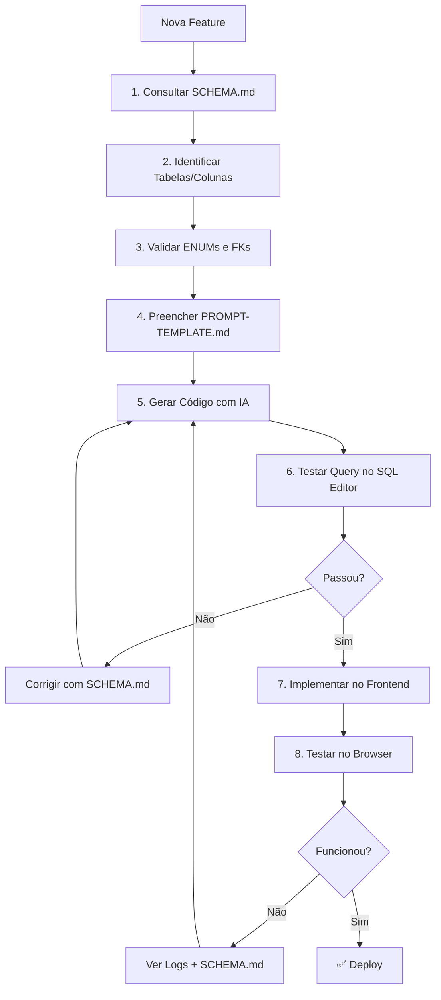

# 🚀 WORKFLOW DE DESENVOLVIMENTO SEM ERROS

**Guia definitivo para nunca mais ter erros de schema no KorLab PAI**

---

## 📊 METODOLOGIA: "SCHEMA-FIRST DEVELOPMENT"



---

## 🎯 PASSO A PASSO DETALHADO

### **PASSO 1: Consultar SCHEMA.md**

**SEMPRE** antes de escrever código:

```bash
# Abra o arquivo
cat SCHEMA.md

# Procure pela tabela
/record_meals

# Anote:
- Nomes exatos das colunas
- Foreign keys
- Campos obrigatórios (NOT NULL)
- Valores de ENUM permitidos
```

**Exemplo:**
```
Preciso criar refeições no recordatório.
↓
Consulto SCHEMA.md → tabela: record_meals
↓
Anoto:
- FK: food_record_id (NÃO record_id)
- Campo: name (NÃO meal_name)
- Obrigatórios: food_record_id, name, order_index
```

---

### **PASSO 2: Preencher PROMPT-TEMPLATE.md**

Use o template padronizado:

```markdown
# IMPLEMENTAÇÃO: [Nome da Feature]

## 🔍 SCHEMA VERIFICADO
- Tabela: record_meals
- Colunas: id, food_record_id, name, time, order_index
- FK: food_record_id → food_records.id
- Consultei SCHEMA.md: ✅ SIM

## 🎯 OBJETIVO
[Descrever]

## 🔧 PSEUDOCÓDIGO
[Com nomes corretos das colunas]
```

---

### **PASSO 3: Gerar Código com IA**

**Bolt.new / Lovable:**

```
CONTEXTO:
Consulte o SCHEMA.md anexado.

TAREFA:
Implemente a feature de [X] conforme o prompt abaixo.

[Cole aqui o PROMPT-TEMPLATE.md preenchido]

CRÍTICO:
- Use nomes EXATOS das colunas do SCHEMA.md
- Valide ENUMs antes de usar
- Adicione logs de debug em cada etapa
```

**Claude Code:**

```
Vou implementar [feature].

Arquivos relevantes:
- SCHEMA.md (documentação do banco)
- PROMPT-TEMPLATE.md (padrão de implementação)

Tarefa:
[Descrever]

Antes de gerar código, confirme:
1. Nomes de colunas estão no SCHEMA.md?
2. Foreign keys corretas?
3. ENUMs válidos?
```

---

### **PASSO 4: Validar Query no SQL Editor**

**Antes de colocar no código, teste no Supabase:**

```sql
-- Testar INSERT
INSERT INTO record_meals (
  food_record_id,  -- ✅ Nome correto
  name,            -- ✅ Nome correto
  order_index
) VALUES (
  'uuid-aqui',
  'Café da Manhã',
  0
)
RETURNING *;

-- Se der erro, ajuste ANTES de codar
```

**Testar SELECT com relacionamentos:**

```sql
SELECT 
  fr.id,
  fr.record_date,
  rm.id as meal_id,
  rm.name as meal_name  -- ✅ rm.name, não rm.meal_name
FROM food_records fr
LEFT JOIN record_meals rm ON rm.food_record_id = fr.id  -- ✅ FK correta
WHERE fr.id = 'uuid-aqui';
```

---

### **PASSO 5: Implementar com Logs Detalhados**

**Sempre adicione logs em etapas:**

```typescript
async function handleAction() {
  try {
    console.log('🔄 ETAPA 1: Validando entrada');
    console.log('recordId:', recordId);
    
    if (!recordId) {
      console.error('❌ recordId inválido');
      return;
    }
    
    console.log('🔄 ETAPA 2: Inserindo no banco');
    
    const { data, error } = await supabase
      .from('record_meals')
      .insert({
        food_record_id: recordId,  // ✅ Log ajuda identificar erro
        name: 'Café da Manhã',
        order_index: 0
      })
      .select();
    
    console.log('📊 Resultado:', { data, error });
    
    if (error) {
      console.error('❌ Erro ao inserir:', error);
      toast.error(`Erro: ${error.message}`);
      return;
    }
    
    console.log('✅ Sucesso! ID:', data.id);
    toast.success('Refeição criada!');
    
  } catch (err) {
    console.error('💥 Erro inesperado:', err);
    toast.error('Erro inesperado');
  }
}
```

---

### **PASSO 6: Debugar com SCHEMA.md**

**Se der erro no browser:**

1. **Copie o log de erro completo**
2. **Abra SCHEMA.md**
3. **Verifique:**

```
Erro: "Could not find the 'record_id' column"
↓
Consulto SCHEMA.md → record_meals
↓
Vejo que é: food_record_id (NÃO record_id)
↓
Corrijo o código
```

```
Erro: "violates check constraint meal_plans_status_check"
↓
Consulto SCHEMA.md → meal_plans → status
↓
Vejo ENUM: 'ativo', 'concluido', 'pausado'
↓
Estava usando: 'active' ❌
↓
Corrijo para: 'ativo' ✅
```

---

## 🛠️ FERRAMENTAS AUXILIARES

### **1. Script de Validação de Schema**

Crie `scripts/validate-schema.ts`:

```typescript
import { createClient } from '@supabase/supabase-js';

const supabase = createClient(
  process.env.VITE_SUPABASE_URL!,
  process.env.VITE_SUPABASE_ANON_KEY!
);

async function validateTables() {
  const tables = [
    'food_records',
    'record_meals',
    'record_items',
    'meal_plans',
    'meals',
    'meal_items'
  ];
  
  for (const table of tables) {
    try {
      const { error } = await supabase
        .from(table)
        .select('*')
        .limit(0);
      
      if (error) {
        console.error(`❌ ${table}:`, error.message);
      } else {
        console.log(`✅ ${table}: OK`);
      }
    } catch (err) {
      console.error(`💥 ${table}:`, err);
    }
  }
}

validateTables();
```

**Executar:**
```bash
npm run validate-schema
```

---

### **2. Hook Customizado para Queries Tipadas**

Crie `src/hooks/useTypedSupabase.ts`:

```typescript
import { useSupabaseClient } from '@supabase/auth-helpers-react';
import { Database } from '@/types/database.types';

export function useTypedSupabase() {
  const supabase = useSupabaseClient<Database>();
  
  return {
    // Queries tipadas
    foodRecords: () => supabase.from('food_records'),
    recordMeals: () => supabase.from('record_meals'),
    mealPlans: () => supabase.from('meal_plans'),
    // ... outras tabelas
  };
}

// Uso:
const { recordMeals } = useTypedSupabase();

await recordMeals()
  .insert({
    food_record_id: '...',  // ✅ TypeScript valida o nome
    name: '...',            // ✅ TypeScript valida o tipo
    order_index: 0
  });
```

---

### **3. Snippet do VS Code**

Crie `.vscode/korlab.code-snippets`:

```json
{
  "Supabase Insert with Logs": {
    "prefix": "sbinsert",
    "body": [
      "console.log('🔄 Inserindo em ${1:table_name}');",
      "",
      "const { data, error } = await supabase",
      "  .from('${1:table_name}')",
      "  .insert({",
      "    ${2:column}: ${3:value}",
      "  })",
      "  .select();",
      "",
      "console.log('📊 Resultado:', { data, error });",
      "",
      "if (error) {",
      "  console.error('❌ Erro:', error);",
      "  toast.error(error.message);",
      "  return;",
      "}",
      "",
      "console.log('✅ Sucesso!');"
    ],
    "description": "Insert com logs detalhados"
  }
}
```

---

## 📋 CHECKLIST ANTES DE COMMITAR

```markdown
## ✅ PRÉ-COMMIT CHECKLIST

- [ ] Consultei SCHEMA.md antes de escrever código?
- [ ] Usei PROMPT-TEMPLATE.md para orientar a IA?
- [ ] Testei query no SQL Editor do Supabase?
- [ ] Adicionei logs em todas as etapas críticas?
- [ ] Validei nomes de colunas contra SCHEMA.md?
- [ ] Confirmei valores de ENUM permitidos?
- [ ] Verifiquei foreign keys corretas?
- [ ] Tratei possíveis erros com try/catch?
- [ ] Testei no browser e vi logs no console?
- [ ] Código está funcionando sem erros?
```

---

## 🎓 BOAS PRÁTICAS

### **DO ✅**

```typescript
// ✅ Consultar SCHEMA.md primeiro
// ✅ Usar nomes exatos das colunas
// ✅ Adicionar logs detalhados
// ✅ Validar ENUMs contra schema
// ✅ Testar query no SQL Editor

const { data, error } = await supabase
  .from('record_meals')
  .insert({
    food_record_id: recordId,  // ✅ Nome correto do SCHEMA.md
    name: 'Café da Manhã',     // ✅ Campo 'name'
    order_index: 0             // ✅ Campo obrigatório
  });
```

### **DON'T ❌**

```typescript
// ❌ Adivinhar nomes de colunas
// ❌ Usar valores de ENUM não documentados
// ❌ Não adicionar logs de debug
// ❌ Não testar antes de implementar

const { data, error } = await supabase
  .from('record_meals')
  .insert({
    record_id: recordId,      // ❌ Nome errado (é food_record_id)
    meal_name: 'Café',        // ❌ Campo errado (é name)
    status: 'active'          // ❌ ENUM não existe nesta tabela
  });
```

---

## 🚨 ERROS COMUNS E SOLUÇÕES

| Erro | Causa | Solução |
|------|-------|---------|
| `Could not find column 'X'` | Nome de coluna errado | Consultar SCHEMA.md |
| `violates check constraint` | ENUM inválido | Verificar valores permitidos no SCHEMA.md |
| `foreign key violation` | FK inexistente/errada | Validar relacionamento no SCHEMA.md |
| `null value violates not-null` | Campo obrigatório vazio | Verificar campos NOT NULL no SCHEMA.md |

---

## 📚 ARQUIVOS DE REFERÊNCIA

1. **SCHEMA.md** - Documentação completa do banco
2. **database.types.ts** - Types TypeScript gerados
3. **PROMPT-TEMPLATE.md** - Template para IAs
4. **WORKFLOW-GUIDE.md** - Este guia (você está aqui!)

---

**🎯 REGRA DE OURO FINAL:**

> **"Nunca escreva código de banco sem consultar SCHEMA.md primeiro"**

Se você seguir este workflow, **NUNCA MAIS** terá erros de:
- ✅ Nomes de colunas errados
- ✅ ENUMs inválidos
- ✅ Foreign keys incorretas
- ✅ Campos obrigatórios faltando

**Workflow em 3 palavras:** Schema → Template → Code